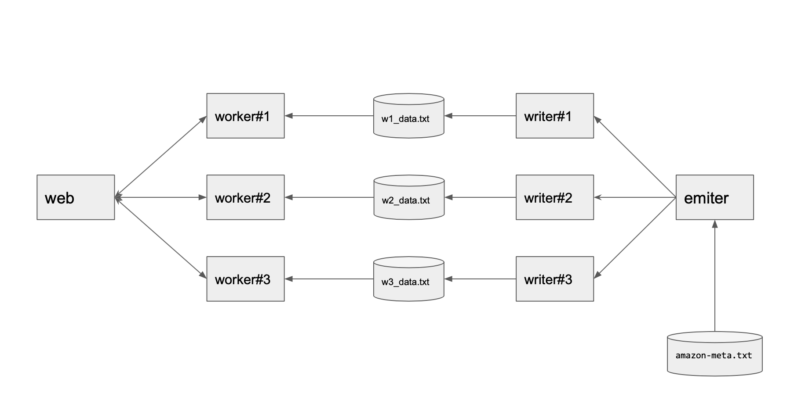
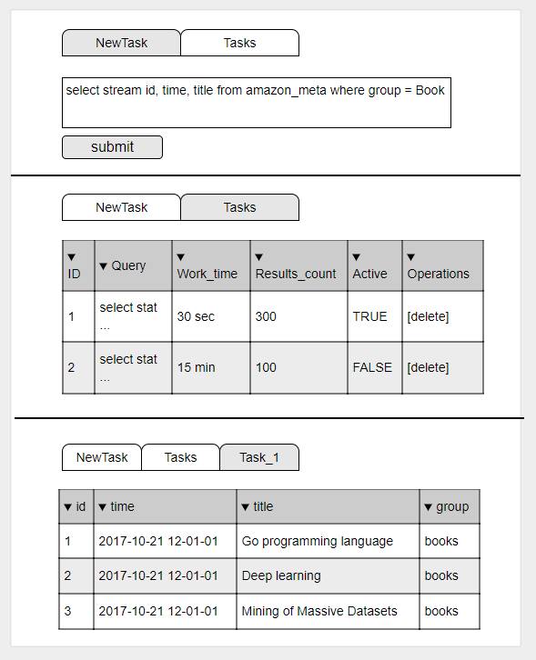

# Что делаем

Пишем своего рода поисковую систему.

web <-> workerX <- workerX.txt <- writter <- emiter <- amazon-meta.txt

каждый квадратик на картинке - это отдельный процесс

# Подробнее про компоненты

## `WEB`

веб - интерфейс который возволяет ввести запрос вида

    select (stream|stat) $fields from $table [ where group = $group ]

где

    $fields = [Id|Time|ASIN|title|group|salesrank] или * 
        т.е. допускается несколько полей через запятую или все
    $table = amazon_reviews (только одна табличка)
    $group = (Baby|Book|CE|DVD|Music|Software|Sports|Toy|Video)

    stream - данные по мере поиска попадают в `WEB`, где их можно посмотреть. 
    stat - статистика по данным, в виде time_minute - count

запрос положится во внутреннее хранилище (про sql мы ничего не знаем, пишем csv|json на диск) с присвоением ему `ID=md5(unix_time)` и отправится на все воркеры (`WORKER`)

ID важен  чтоб потом уметь отменять задачи (кнопочка delete в интерфейсе) и его надо прокидывать дальше другим частям сервиса

соединение с воркерами двустороннее, по tcp, т.е. `WEB` посылает данные в `WORKER` и наоборот, `WORKER` посылает в `WEB`

(stream|stat) - режимы работы

скриншот интерфейса (тут 3 разных страницы)

чтоб такое рисовать используем шаблоны и отдаем хтмл. js и всякие react/angular/... со словами "да я во фронтенд тоже умею!" запрещены. рендерим страничку только в golang и потом отдаем браузеру html.

C воркером обрщаются по самодельному бинарному асинхронному протоколу поверх TCP (т.е. не HTTP)

Формат протокола

    <msg_id:uint32><seq:uint32><data_len:uint32><data_json:[]byte><data_crc32:uint32>

    msg_id - код комманды
    seq - автоинкрементный счетчик
    data_len - длина данных
    data_json - данные, запакованные в json. что запоковывать - вам предстоит договориться самим
    data_crc32 - хеш-сумма от пересланных данных

соединение устанавливает воркер - он знает адрес веб-а. то есть воркер делает dial, а веб listen

для общения по бинарному протоколу смотрите пример 3/1_net

для реализации парсинга и сериализации бинарного протокола можно посмотреть на <https://pkg.go.dev/encoding/binary>

---

## `WORKER`

основной сервис поиска

работает в 3-х режимах:

1. stream - ищет данные по workerX.txt со скоростью не более 1000 записей/сек (1000 конфигурится), что нашлось - отправляет в `WEB`
2. stat - делает то же самое и не более 1000 записей/сек (1000 конфигурится), но считает стаистику в виде time_minute - count и отправляет её в `WEB`. то есть в отличии от stream он шлет в веб стату раз в минут по встреченным записям, а не сами записи

заданий в обработке у воркера может быть несколько

статус воркера надо сохранять на диск - можно тупо json - т.е. если вокрер падает или если процесс перезапустить - он поднимается с последнего сохранённого состояния

моежт быть запущен в нескольких экземплярах

для конфигурирования приложения можно использовать <https://pkg.go.dev/flag>.   тогда сможете один код запускать с разными параметрами на разных портах  
запуск может выглядеть так: `go run ./worker/main.go -web_port 80 -num 1`  
`web_port` - это порт на котором слушает web и куда идти с tcp. `num` - номер воркера, чтоб можно было понять из какого файла ему читать.

-----

## `DATA` ( workerX.txt )

просто данные на диске  
куда постоянно пишет writer  
если файла еще нет, то writer должен его создать

-----

## `WRITER`

Сервис который принимает по сети (http) данные и пишет на диск (workerX.txt)  
поднят в нескольких экземплярах, количество равно количеству воркеров. Т.е. сколько воркеров - столько врайтеров - столько файлов с данными.  
К данным добавляет поле Time (текущее значение времени)  
Данные пишет в файл соответствующего WORKERа  

запуск может выглядеть так: `go run ./writer/main.go -port 8081 -num 1`

-----

## `EMITER`

сервис который читает данные из amazon-meta.txt.gz, берёт `crc32(id) % WRITERS_COUNT` и шлёт в соответствующий ему `WRITER`. то есть не все данные шлются во все врайтеры, а делятся на равные части и шлются им поочереди.  
рейт - не более 1 записи в секунду ( под конфигом).  
данные шлёт все что там есть - парсит всё, а не только то что мы выше можем указать.  
эмитер заранее знает сколько врайтеров будет и на каких портах они будут слушать.

данные должны лежать на сервере в
/var/tmp/amazon-meta.txt.gz

скачать в вебе
<https://cloud.mail.ru/public/Drsk/FpkBV7TF4>

оригинал ( оттуда медленно качается )
<https://snap.stanford.edu/data/amazon-meta.html>

пример запуска эмитера: `go run ./emiter/main.go -writers_ports 8081,8082,8083 -num 1`

для отладки, пока врайтеры еще не готовы, можете использовать `nc -l 8081` - эта штука просто поднимает сервер на порту 8081 и пишет в stdout то, что ей присылают на заданный порт.

# Детали разработки

Код пишем у себя на ноутах, для отладки у вас есть сервак, где можно всё запустить вместе. так же можете помнить про ngrok - он может помочь запускать разные части на разных ноутах, но тогда надо будет еще добавить flag с хостнеймом куда идти.  
Код в гите, репу не форкаем! работаем прямо в ней, пишем в отдельных ветках, когда надо - мерджимся.  
у каждой команды будет своя общая ветка teamX. свои ветки тоже называйте с префиксом teamX_... чтоб понятно было из какой вы команды.

Задача параллелится на следующие подзадачи:

0. протокол общения - какие структуры, чего куда, в каком формате храним данные
1. веб - парсинг запроса
2. веб - страницы вывода списка задач + результатов
3. реализация протокола общения с воркером - сетевой слой
4. сохранение результатов и списока задач
5. воркер - очередь и переключалка задач, статус задач, статистика по задачам
6. воркер - stream-поиск
7. воркер - stat-поиск
8. writer - приём данных, время, сохранение на диск
9. emiter - парсинг файла, выборка нужного, отправка во writer

# Порядок работы

0. обсудить задачу в целом
1. выбрать координаторов/тимлидов, которые будут отвечать за взаимодействие между группами и общий успех
2. разбиться на группа
3. обсудить задачу группы
4. обсудить протоколы общения с взаимодействующими компонентами ( т.е. worker обсуждает протокол с web, а так же формат данных с writer; writer - формат данных на диске с worker, формат приёма данных с emiter )
5. начинать писать код

внимание!

* если не будет координатора/тимлида - будет хаотичная разработка и в итоге ничего не заработает
* если вы не договоритесь о форматах и прочем, а сразу же броситесь писать код - в итоге выяснится, что компоненты между собой не совместимы и ничего не работает
* если вы начнете интегрироваться в конце - скорее всего ничего не заработает. интеграцию надо или начинать с самого начала, или, хотя бы, в середине дня

проверено :)

писать код лучше в режиме парного-тройного программирования, периодически меняясь у клавиатуры

# Деплой

помимо того, что разработать, надо еще и выложить ваш код куда-то и запустить там для демонстрации. под эту задачу мы выделили вам по одной виртуалке на каждую команду, на которых в конце дня должены быть подняты все компоненты вашего сервиса.

как ssh-нуться в виртуалку:
    chmod 600 vm_access_key.pem (это надо один раз сделать чтоб изменить права доступа)
    ssh -i vm_access_key.pem <ваш логин gitlab>@< ip виртуалки>
как закинуть файл на виртуалку:
    scp <файл> <ваш логин gitlab>@< ip виртуалки>:~/

адреса Виртуалок:

    команда 1
    vk_edu_golang_hk-1
    185.86.147.69

    команда 2
    vk_edu_golang_hk-2
    185.86.147.57

    команда 3
    vk_edu_golang_hk-3
    89.208.210.98

# После хакатона

так же вам надо будет заполнить отчет по результатам хакатона и ответить на следущие вопросы

1. над каким компонентом вы работали, что именно вы писали
2. кто работал вместе с вами в группе/команде
3. с какими проблемами/трудностями вы встрелились (любого характера)
4. какие знания вам пригодились, какие знания вы применяли
5. каких знаний вам не хватило и пришлось быстро гуглить, читать доку, разбираться
6. что получилось, почему?
7. что не получилось, почему?
8. что лично вы могли бы сделать лучше в следующий раз?
9. что вы, как команда, могли бы сделать лучше в следующий раз?

отчет надо оформить в файлик `hakaton1.md` и закоммитить в свой репозиторий с лекциями, где вы обычно решаете домашки. а потом как обычно скинуть МР в личку

без отчета баллы не выставляются
